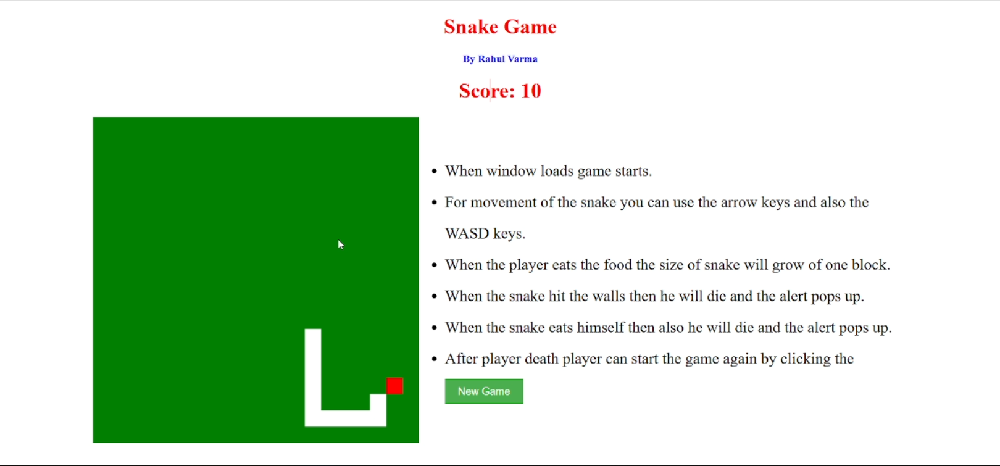

# Snake Game

This is a Javascript project. In this game, the player can move and eat the food and try to not bump in the walls and don't eat itself.

## Overview

### The Theme

Users should be able to:

-   Move the snake left right up and down by using arrow keys or with WASD keys.
-   Eat the food and according to it the snake body size will grow and the player will score points which is displayed above.

### Screenshot

| Main Game                         |
| --------------------------------- |
|  |

### Built with

-   HTML5
-   CSS custom properties
-   Flexbox
-   JavaScript

